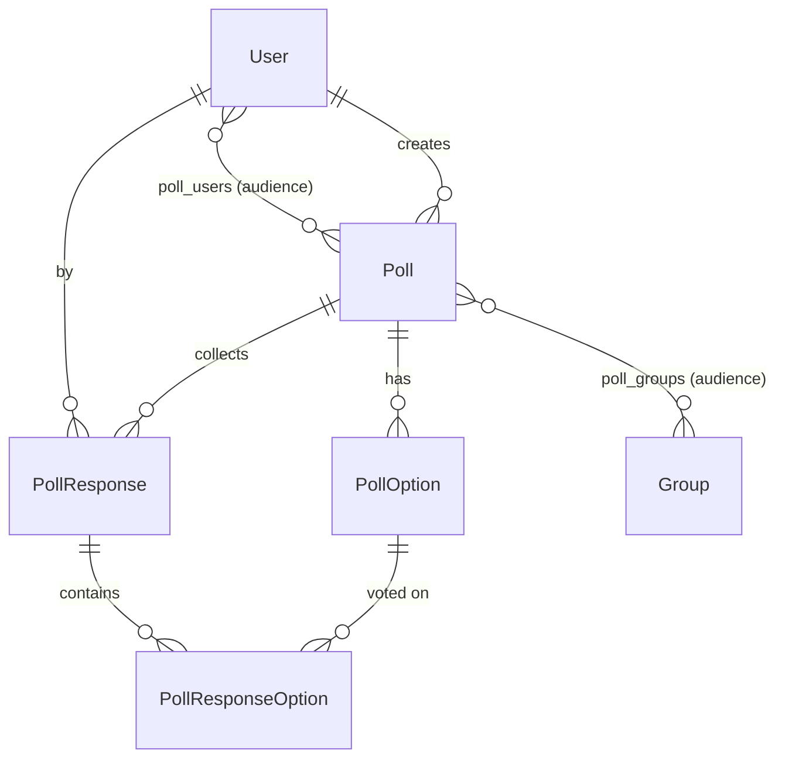

# Struudel — Architecture & Developer Guide

Self-hosted Doodle-style polling tool. Python 3.13, Flask 3, PostgreSQL, Redis, Huey.

This document captures conventions, architecture and non-obvious domain semantics —
read it before making non-trivial changes. It is also loaded automatically as Claude
Code context via the root `CLAUDE.md` import.

## Commands

```bash
make dev-build       # rebuild dev image (after dep changes)
make dev-run         # start full stack (app + worker + postgres + redis)
make dev-shell       # bash inside app container
make dev-psql        # psql against dev postgres
make redis-cli       # redis-cli against dev redis
make db-upgrade      # run pending alembic migrations
make db-migrate MSG="description"  # generate migration (autogenerate)
make lint            # ruff check
make format          # ruff format
make type-check      # ty check
make css-build       # compile Tailwind + daisyUI → static/css/app.css (minified)
```

All commands run inside Docker via `docker compose -f compose.yaml -f compose-dev.yaml`.

## Language

**User-facing strings are English.** This includes all HTML templates, flash messages,
form labels, error messages and button captions. `<html lang="en">` is set in
`base.html`. Code comments, identifiers and log messages are English by convention
anyway — no separate rule needed.

No i18n framework is in place; strings are hardcoded in templates. If localisation is
ever required, Babel/Flask-Babel would be the path.

## Frontend / CSS

**Stack:** Tailwind CSS v4.1.18 + daisyUI v5.5.19 + Tabler Icons v3.41.1 (webfont) + Alpine.js v3 (vendored)

**Source:** `css/input.css` → compiled to `src/struudel/static/css/app.css`

```
css/
  input.css           # Tailwind entry point (@import, @source, @plugin)
  daisyui.mjs         # daisyUI v5 plugin bundle (vendored)
  daisyui-theme.mjs   # daisyUI theme plugin (vendored)
src/struudel/static/
  css/app.css         # compiled output — do not edit by hand
  vendor/tabler-icons/
    tabler-icons.min.css
    fonts/            # woff2, woff, ttf
  vendor/alpine/
    alpine.min.js     # Alpine.js v3 (vendored, loaded with `defer`)
  vendor/htmx/
    htmx.min.js       # HTMX (vendored)
  vendor/sortablejs/
    Sortable.min.js   # SortableJS v1.15.6 (vendored) — used for drag-and-drop reorder
```

**JavaScript:**
- Alpine.js for client-side reactivity (form toggles, dynamic rows, interactive components) — use `x-data`, `x-model`, `:disabled` etc. directly in templates
- HTMX for server-driven partial updates (search, pagination, lazy-loaded partials)
- SortableJS for drag-and-drop reordering inside Alpine-managed lists
- All three are vendored — no CDN in production, no bundler

**Alpine + SortableJS pattern:**
Alpine owns the state (array of items), SortableJS only reorders DOM nodes and reports
the new order via `onEnd`. The Alpine array is synced in the callback:

```js
Sortable.create(this.$refs.list, {
    handle: ".handle",
    animation: 150,
    onEnd: (e) => {
        if (e.oldIndex === e.newIndex) return;
        const [moved] = this.options.splice(e.oldIndex, 1);
        this.options.splice(e.newIndex, 0, moved);
    },
});
```

Keep each item keyed by a stable client-side `_uid` so Alpine does not re-render the
row on every property change.

**Form serialisation pattern (for dynamic Alpine-managed lists):**
- Hidden `<input name="...">` bound via `:value="serialize()"` receives a JSON string on submit
- Server accepts the string as `Json[list[...]]` in the Pydantic form model
- Empty payload is normalised to `"[]"` via a `BeforeValidator`

**HTMX + Alpine bridge:**
HTMX swaps HTML subtrees that may contain Alpine directives (`x-data`, `@click`,
`x-model`, ...). A global listener in `base.html` re-initialises Alpine on each swap:

```js
document.body.addEventListener("htmx:afterSettle", (e) => {
    if (window.Alpine) window.Alpine.initTree(e.detail.target);
});
```

This lets us build suggest-style inputs:
- Input fires `hx-get` → server renders a result partial (e.g. `<li>` items)
- Each item has `@click.prevent="addFoo({...})"` → Alpine method on the enclosing
  `x-data` scope adds a chip to its reactive state
- Form submission reads the Alpine state, serialises it to a hidden JSON field

**Passing server data into Alpine handlers:**
- For item payloads in HTMX-rendered partials, pass values via `data-*` attributes and
  read them in the handler through `$event.currentTarget.dataset.*`. This avoids
  quoting problems that arise when user-generated strings appear inline in an
  expression attribute:

  ```html
  <a data-id="{{ item.id }}"
     data-label="{{ item.name }}"
     @click.prevent="addFoo({
         id: Number($event.currentTarget.dataset.id),
         label: $event.currentTarget.dataset.label,
     })">...</a>
  ```

  Jinja's HTML autoescape handles the attribute values safely; Alpine receives plain
  strings at runtime.

- For the initial state passed into `x-data` via `| tojson`, wrap the attribute in
  single quotes (Flask's `tojson` escapes `'` to `\u0027`, so the JSON payload is
  always safe inside single-quoted attributes):

  ```html
  <div x-data='myEditor({{ initial | tojson }})'>...</div>
  ```

**Workflow:**
- After changing templates or `input.css`, run `make css-build` and commit the updated `app.css`
- `docker build` also rebuilds `app.css` from scratch in the `css-builder` stage — the committed file is authoritative for the source tree, the image always ships a freshly compiled copy
- `app.css` is a build artifact — never edit by hand, always regenerate via `make css-build`

**Icons:** Tabler Icons webfont — use `<i class="ti ti-<name>"></i>`. Icon names: https://tabler.io/icons

**Themes:** daisyUI theme set via `data-theme="..."` on `<html>`. Default: `light`. Available themes are all standard daisyUI v5 themes.

**What not to do:**
- Do not write custom CSS in `app.css` — it is overwritten on every build
- Do not use Bootstrap or any other CSS framework — Tailwind/daisyUI only
- Do not use Bootstrap Icons (`bi-*`) — use Tabler Icons (`ti ti-*`)

## Architecture

```
src/struudel/
  app.py              # application factory (create_app)
  auth.py             # cross-cutting auth decorator (require_auth)
  cli.py              # Flask CLI commands (e.g. superuser bootstrap)
  config.py           # pydantic-settings (Settings), DSN via @computed_field
  csrf.py             # CSRFProtect singleton + init_csrf(app)
  database.py         # SQLAlchemy engine + SessionLocal
  extensions.py       # shared singletons: huey, session_redis_client, app_state_redis_client, oauth
  mail.py             # SMTP helper used by mail tasks
  request_hooks.py    # before_request handler that populates g.user
  template_filters.py # Jinja filters (init_template_filters)
  template_globals.py # Jinja context processor (init_template_globals)
  timezones.py        # timezone helpers
  version.py          # VERSION + COMMIT exposed to templates
  blueprints/
    <feature>/
      __init__.py     # Blueprint object + routes import
      routes.py       # route handlers only, no business logic
      templates/
        <feature>/    # namespaced templates
  models/
    base.py           # TimestampMixin
    <entity>.py       # one ORM model per file
    associations.py   # N:M tables
  services/
    <entity>.py       # business logic; db as first positional arg
  tasks/
    __init__.py       # imports all task modules for Huey registration
    <domain>/
      <task_name>.py  # one task per file
```

## Key Conventions

### Services
- Signature: `def fn(db: Session, *, keyword_args) -> ReturnType`
- `db` is positional, all domain parameters are keyword-only (`*`)
- Return ORM objects, not dicts — caller decides what to do with them
- Services own business logic and DB writes; tasks and routes call services
- Session lifecycle (`with SessionLocal() as db:`) belongs in the caller, not the service

### Tasks (Huey)
- One task per file under `tasks/<domain>/<task_name>.py`
- Tasks are thin: open a session, call a service, done
- Every new task module must be imported in `tasks/__init__.py` for registration
- Tasks never contain business logic

### Blueprints
- Blueprint object in `__init__.py`, routes in `routes.py`
- Templates namespaced: `blueprints/<feature>/templates/<feature>/<name>.html`
- Route handlers return early on errors, delegate all logic to services
- All route return types must be annotated; tuples need `Response | tuple[Response, int]`

### Cross-cutting utilities
- Auth decorator and other cross-blueprint utilities live at `struudel/<name>.py` (top-level module), not inside a blueprint
- Import them as `from struudel.auth import require_auth`

### Models
- SQLAlchemy 2.x with `Mapped[]` + `mapped_column()`
- `TYPE_CHECKING` guard for forward references to avoid circular imports
- **The initial schema migration (`20260417_1200_initial_schema.py`) is the release baseline — do not edit it.** Any schema change must land in a new Alembic migration generated via `make db-migrate MSG="..."` or hand-written if autogenerate misses the diff. Production DBs are upgraded incrementally via `alembic upgrade head` on container start.
- `updated_at` managed by PostgreSQL trigger, not application code

### Config
- `pydantic-settings` — all env vars map to `Settings` fields (case-insensitive)
- Required fields default to `""` and are checked in `_require_settings` validator
- `database_url` is built via `@computed_field` + `@cached_property`
- `create_app()` sets a curated subset of `settings` keys onto `app.config` explicitly (e.g. `SECRET_KEY`, `SESSION_*`) — there is no automatic `settings.model_dump()` → `app.config` mapping; access settings via `from struudel.config import settings` instead

## Domain Model

Core entities and how they relate. Field-level truth lives in `src/struudel/models/` — this section captures non-obvious semantics and invariants.



- **Templates**: `PollStatus.TEMPLATE` is mutually exclusive with `DRAFT`/`ACTIVE`/`CLOSED`. Templates are duplicated into real polls, never directly voted on. Any poll (template or real) can be duplicated.
- **Audience**: `poll_users` and `poll_groups` list the people invited to the poll. Membership has no per-member role; everyone in the audience receives the same invitation. Audience members get email invites (mail-stack TBD).
- **Mandatory polls**: `is_mandatory=True` means every audience member must respond. Two invariants are enforced server-side:
  - `visibility=PUBLIC` ⇒ `is_mandatory=False` (a public poll has no defined audience to require)
  - `is_mandatory=True` + `status=ACTIVE` ⇒ audience must be non-empty (DRAFT polls may be mandatory without audience yet)
- **Visibility**: `PRIVATE` polls rely on the audience tables (`poll_users`, `poll_groups`) for access control. `PUBLIC` polls are open to every authenticated user; audience tables are empty in that case. Anonymous access is never allowed.
- **Share token**: every poll has a `share_token` (UUID, default `gen_random_uuid()`) for link sharing. The share link grants access only to users already in the audience (PRIVATE) or to any authenticated user (PUBLIC) — never bypasses auth.
- **Response mode** (`PollResponseMode`): determines the semantics of `PollResponseOption.status`:
  - `YES_NO_MAYBE` — classic Doodle: status is `YES` / `NO` / `MAYBE`
  - `SINGLE_CHOICE` — user picks exactly one option: exactly one `YES`, rest `NO`
  - `MULTI_CHOICE` — user picks N options: any number of `YES`, rest `NO`, no `MAYBE`
- **Option types** are mixable per poll (`DATE`, `DATETIME`, `TEXT`). A CHECK constraint (`ck_poll_options_value_matches_type`) enforces that exactly the value column matching `option_type` is non-null.
- **Custom options**: user-added options require `poll.allow_custom_options=True`; they carry `is_custom=True` and `created_by_id`. Other users can still vote on them.
- **One response per user per poll**: enforced by `uq_poll_responses_poll_user`. Re-submitting overwrites. Edit window is bounded by `poll.allow_edit_responses` and `poll.edit_responses_until`.
- **Lifecycle**: `starts_at` gates participation at runtime (no background flip; users simply can't vote yet). `ends_at` triggers an `ACTIVE → CLOSED` transition via the periodic Huey task `close_due_polls_task` (every 5 minutes, `tasks/poll/close_due.py`). `auto_delete_at` is set by the app when a poll transitions to `CLOSED` and the `auto_delete` flag in `poll.attributes` is truthy — the value is `now + settings.poll_retention_days` (default 30). The periodic Huey task `purge_expired_polls_task` (daily at 03:00 UTC, `tasks/poll/purge_expired.py`) deletes polls whose `auto_delete_at` has passed.
- **`poll.attributes` (JSONB)**: soft bucket for feature flags that don't need indexing/filtering (`anonymous_votes`, `hide_results_until_close`, `notify_owner_on_response`, `max_yes_choices`, …). Anything that needs to be queried, filtered, or scheduled stays a first-class column.

### Voting semantics

- **Explicit NO**: every option in a response has an explicit status. The client sends
  one `VoteItem` per option; the server stores it as `PollResponseOption`. No implicit
  defaults — a missing option-id simply means "no vote" and does not create a row.
- **Idempotent submit**: `poll_service.submit_response` performs an upsert on
  `PollResponse` (via the `uq_poll_responses_poll_user` constraint), deletes all
  existing `PollResponseOption` rows for that response, and inserts the new set.
- **Two-stage guard** via `VoteGuard(can_vote, can_edit, reason)`:
  - `can_vote` — new responses are allowed (poll is ACTIVE and inside the time window)
  - `can_edit` — existing responses may still be updated (driven by
    `poll.allow_edit_responses` and `poll.edit_responses_until`)
  - Update of an existing response is allowed if `can_vote or (has_existing and can_edit)`.
  - Routes return 409 when neither holds.
- **Access control**: only users that pass `user_can_view_poll` may reach the vote
  route. PUBLIC polls are open to every authenticated user; PRIVATE polls require a
  direct or group-based audience membership.
- **Mode UX vs. storage**: client-side constraints for `SINGLE_CHOICE` (exclusive YES)
  and `MULTI_CHOICE` with `max_yes_choices` are enforced in Alpine for live feedback.
  The server independently enforces the same rules in
  `_validate_votes_against_mode` (raises `InvalidVoteError` on violations): MAYBE
  is rejected in `SINGLE_CHOICE` and `MULTI_CHOICE`; `SINGLE_CHOICE` allows at most
  one YES; `MULTI_CHOICE` honours the `max_yes_choices` cap when set. Routes turn
  `InvalidVoteError` into a 400.
- **Anonymity**: when `poll.attributes.anonymous_votes=True`, the response summary
  returns `ResponseRow.user=None` and the comment field is hidden in the UI (otherwise
  the comment becomes a fingerprint).
- **Hidden results**: when `poll.attributes.hide_results_until_close=True` and
  `poll.status != CLOSED`, the vote template renders a placeholder instead of the
  summary table. The server still computes the tally — the hiding is UI-only and always
  disclosed to the owner via the info tab.

## Redis Layout

| DB | Purpose |
|----|---------|
| 0  | Huey task queue (`huey_redis_url`) |
| 1  | Flask sessions (`session_redis_url`) |
| 2  | App-level state — mail dedup locks, etc. (`app_state_redis_url`). Use `app_state_redis_client` from `struudel.extensions`. Key prefix: `<feature>:<purpose>:...` (e.g. `mail:reminder:<poll_id>:<user_id>:<tier>`). |

## Required Environment Variables

```
DB_USER, DB_PASS          # database credentials
OIDC_DISCOVERY_URL        # OpenID Connect discovery document URL
OIDC_CLIENT_ID            # OIDC client credentials registered with the IdP
OIDC_CLIENT_SECRET
SCIM_TOKEN                # Bearer token expected at /scim/v2 — must match the IdP's SCIM connector
SECRET_KEY                # Flask session signing key — no built-in fallback, no insecure default
SESSION_COOKIE_SECURE     # true behind TLS in production, false only for HTTP dev — must be set explicitly
```

Optional with sensible defaults: `DB_HOST`, `DB_NAME`, other session settings, `HUEY_WORKERS` (default: 4). Note: `_require_settings` defensively also rejects empty `DB_HOST` / `DB_NAME` — the defaults are non-empty so this only triggers if the env explicitly sets them to `""`.

DB credentials and other secrets come from `.env`; `compose-dev.yaml` injects dev-specific overrides (mail to mailpit, `APP_BASE_URL=http://localhost:5009`, `FLASK_DEBUG=1`, `SESSION_COOKIE_SECURE=false`).

## Auth & Current User

`g.user` is populated from the session on every request via a `before_request` handler. The handler lives in `struudel/request_hooks.py` and is wired up by `init_request_hooks(app)` from `create_app()`. The value is either a dict with user claims or `None`.

**Default: every route requires authentication.** Apply `@require_auth` to all route handlers. Routes that explicitly do not require auth (login, authorize, callback, health endpoints) are the exception — document why in a comment if non-obvious.

Routes that need the current user access it via `g.user` — never via `session.get("user")` directly.

```python
# protected route
@bp.route("/something")
@require_auth
def something() -> str:
    user_id = g.user["id"]
    ...

# explicitly public route — no @require_auth
@bp.route("/login")
def login() -> str:
    ...
```

## Security Rules

- Validate `next=` redirect targets with `_is_safe_redirect()` before storing in session
- Never redirect to `user.picture` or any URL from untrusted input without validation
- All OAuth/OIDC calls must be wrapped in try/except — provider can be unavailable
- Image downloads in tasks: enforce size limit (`_AVATAR_MAX_BYTES`), catch `UnidentifiedImageError`

## CSRF

Global CSRF protection is enforced via `flask-wtf`'s `CSRFProtect`. WTForms itself is
not used anywhere — we only consume the CSRF module. The singleton lives in
`struudel/csrf.py` and is wired up in `create_app()` before blueprint registration.

- Every HTML `<form method="post|put|patch|delete">` must include
  `<input type="hidden" name="csrf_token" value="{{ csrf_token() }}">` as its first field
- `base.html` exposes the token via `<meta name="csrf-token">` — an `htmx:configRequest`
  listener in `static/js/struudel.js` reads it and attaches `X-CSRFToken` to every HTMX
  request automatically (no per-form config needed)
- Token is session-bound, `WTF_CSRF_TIME_LIMIT = None` — it lives as long as the session does
- SCIM blueprint is exempt (`csrf.exempt(scim_bp)` in `create_app()`) because it uses
  Bearer-token auth, not browser sessions
- Failed validation renders `templates/errors/csrf.html` with HTTP 400
- New JSON APIs: either use token-based auth and `csrf.exempt(...)`, or have the client
  send `X-CSRFToken` explicitly

## What Not to Do

- Do not use Flask-SQLAlchemy or Flask-Migrate — plain SQLAlchemy + Alembic only
- Do not use Flask-Login — session-based auth via `struudel.auth.require_auth`
- Do not put business logic in route handlers or task functions
- Do not add error handling for scenarios that cannot happen — only at system boundaries
- Do not add comments explaining what code does — only why, when non-obvious
- Do not add `cached_picture` to standard ORM queries — it is `deferred=True`
- Do not skip type annotations — all functions must be annotated; use `ty check` to verify
